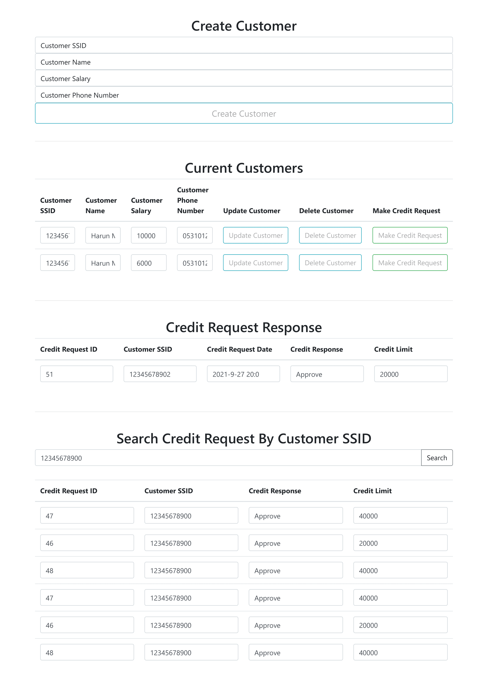

[comment]: <> (# Ödev Son Teslim Tarihi : 29 Eylül - Saat: 23:00)

[comment]: <> (![odevpart1]&#40;https://user-images.githubusercontent.com/45206582/133460137-dbd5583e-1ac9-426f-a6f0-abf5983f6fd6.PNG&#41;)

[comment]: <> (![odevpart2]&#40;https://user-images.githubusercontent.com/45206582/133460164-f0b61470-f3e9-49cb-8b0e-8ae9afb45e2e.PNG&#41;)

[comment]: <> (![odevpart3]&#40;https://user-images.githubusercontent.com/45206582/133460177-2e2e561e-e1ac-4c42-96a7-5bce51eb8228.PNG&#41;)

##SETUP
* To build this project:

Project can be build in a two way,

   1.Monolithic Architecture

   2.Microservice Architecture

### 1. Monolithic Architecture
   1. Clone the project

      `git clone https://github.com/113-GittiGidiyor-Java-Spring-Bootcamp/gittigidiyor-graduation-project-bulutharunmurat.git`

   2. Navigate to CreditScoreCalculator folder and execute this command:
   
       `mvnw spring-boot:run`

Project would start at port 8080. `http://localhost:8080`

### 2. Microservice Architecture
   
   1. Clone the project

      `git clone https://github.com/113-GittiGidiyor-Java-Spring-Bootcamp/gittigidiyor-graduation-project-bulutharunmurat.git`

   2. Comment out creditScoreCalculator method at CreditRequestService at line 52.
      
      `double creditScore = this.creditScoreCalculator(customerSSID);`

   3. And implement commented line 48.
      
      ` double creditScore = creditScoreClient.findCustomerCreditScoreWithSsid(customerSSID);`

   4. Finally, go to project directory and run docker-compose.yml file.

      `docker-compose -f docker-compose.yml up`

Project would start at `http://localhost:8080`, `http://localhost:8081` and `http://localhost:8761`,
you can find the frontend page at `http://localhost:8080`.

## FRONTEND

* HTML and JavaScript codes can be found at [public-directory](CreditScoreCalculator/src/main/resources/public).

## USING LOF4J LOGGER
* If you want to save logs to MySQL database;
* Create the database table LOGS, in schema test. After table create in database all logs saved to logs table automatically.

`
CREATE TABLE LOGS
(
USER_ID VARCHAR(20) NOT NULL,
DATED   DATETIME NOT NULL,
LOGGER  VARCHAR(100) NOT NULL,
LEVEL   VARCHAR(50) NOT NULL,
MESSAGE VARCHAR(1000) NOT NULL
);
`

## ENDPOINTS

### For Customer

* [Show Customers](documents/api/customer/show-customers.md) : `GET /api/customers`
* [Show Customer](documents/api/customer/show-customer.md) : `GET /api/customers/{ssid}`
* [Create Customer](documents/api/customer/create-customer.md) : `POST /api/customers`
* [Update Customer](documents/api/customer/update-customer.md) : `PUT /api/customers`
* [Delete Customer](documents/api/customer/delete-customer.md) : `DELETE /api/customers/{ssid}`

### For Credit

* [Get Credit Responses of Customer with SSID](documents/api/credits/find-credit-responses-of-customer.md) : `GET /api/credit-request/{ssid}`
* [Make Credit Request for Customer with SSID](documents/api/credits/make-credit-request-for-customer.md) : `POST /api/credit-request/{ssid}`

## Author

**Harun Murat Bulut**

* [github/bulutharunmurat](https://github.com/bulutharunmurat)
